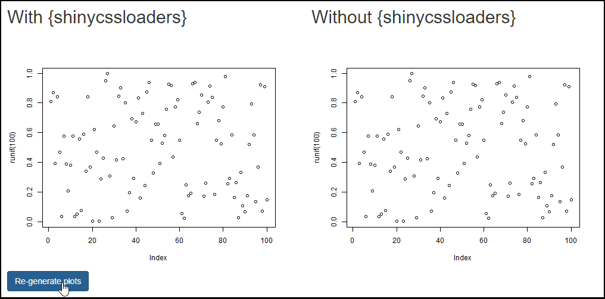

<h3 align="center">shinycssloaders</h3>
<h4 align="center">
  ⌛ Add loading animations to a Shiny output while it's recalculating
</h4>

<p align="center">
  <a href="https://github.com/daattali/shinycssloaders/actions/workflows/R-CMD-check.yaml">
    
  </a> 
  <a href="https://cran.r-project.org/package=shinycssloaders">
    
  </a>
</p>

---

When a Shiny output (such as a plot, table, map, etc.) is recalculating, it remains visible but gets greyed out. Using {shinycssloaders}, you can add a loading animation ("spinner") to outputs instead of greying them out. By wrapping a Shiny output in `withSpinner()`, a spinner will automatically appear while the output is recalculating. You can also manually trigger a spinner using `showSpinner()`.

In addition to showing spinners on outputs, you can also use `pageSpinner()` to show a full-page spinner that covers the entire page.

You can choose from one of 8 built-in animation types, and customize the colour/size. You can also use your own image instead of the built-in animations. See the [demo Shiny app](https://daattali.com/shiny/shinycssloaders-demo) online for examples.

**Need Shiny help? [I'm available for consulting](https://attalitech.com/).**<br/>
**If you find {shinycssloaders} useful, please consider [supporting my work](https://github.com/sponsors/daattali)! ❤**

<p align="center">
  <a style="display: inline-block;" href="https://github.com/sponsors/daattali">
    
  </a>
  <a style="display: inline-block;" href="https://paypal.me/daattali">
    
  </a>
</p>

> This package is part of a larger ecosystem of packages with a shared vision: solving common Shiny issues and improving Shiny apps with minimal effort, minimal code changes, and clear documentation. Other packages for your Shiny apps:

| Package | Description | Demo |
|---|---|---|
| [shinyjs](https://deanattali.com/shinyjs/) | 💡 Easily improve the user experience of your Shiny apps in seconds | [🔗](https://deanattali.com/shinyjs/overview#demo) |
| [shinyalert](https://github.com/daattali/shinyalert/) | 🗯️ Easily create pretty popup messages (modals) in Shiny | [🔗](https://daattali.com/shiny/shinyalert-demo/) |
| [shinyscreenshot](https://github.com/daattali/shinyscreenshot/) | 📷 Capture screenshots of entire pages or parts of pages in Shiny apps | [🔗](https://daattali.com/shiny/shinyscreenshot-demo/) |
| [timevis](https://github.com/daattali/timevis/) | 📅 Create interactive timeline visualizations in R | [🔗](https://daattali.com/shiny/timevis-demo/) |
| [colourpicker](https://github.com/daattali/colourpicker/) | 🎨 A colour picker tool for Shiny and for selecting colours in plots | [🔗](https://daattali.com/shiny/colourInput/) |
| [shinybrowser](https://github.com/daattali/shinybrowser/) | 🌐 Find out information about a user's web browser in Shiny apps | [🔗](https://daattali.com/shiny/shinybrowser-demo/) |
| [shinydisconnect](https://github.com/daattali/shinydisconnect/) | 🔌 Show a nice message when a Shiny app disconnects or errors | [🔗](https://daattali.com/shiny/shinydisconnect-demo/) |
| [shinytip](https://github.com/daattali/shinytip/) | 💬 Simple flexible tooltips for Shiny apps | WIP |
| [shinymixpanel](https://github.com/daattali/shinymixpanel/) | 🔍 Track user interactions with Mixpanel in Shiny apps or R scripts | WIP |
| [shinyforms](https://github.com/daattali/shinyforms/) | 📝 Easily create questionnaire-type forms with Shiny | WIP |

# Table of contents

- [Example](#example)
- [How to use](#usage)
- [Installation](#install)
- [Features](#features)
- [Sponsors 🏆](#sponsors)

<h2 id="example">Example</h2>

For interactive examples and to see some of the features, [check out the demo app](https://daattali.com/shiny/shinycssloaders-demo/).

Below is a simple example of what {shinycssloaders} looks like:



<h2 id="usage">How to use</h2>

Simply wrap a Shiny output in a call to `withSpinner()`. If you have `%>%` loaded, you can use it, for example `plotOutput("myplot") %>% withSpinner()`.

Basic usage:

```r
library(shiny)

ui <- fluidPage(
    actionButton("go", "Go"),
    shinycssloaders::withSpinner(
        plotOutput("plot")
    )
)
server <- function(input, output) {
    output$plot <- renderPlot({
        input$go
        Sys.sleep(1.5)
        plot(runif(10))
    })
}
shinyApp(ui, server)
```

Using a full-page spinner:

```r
library(shiny)

ui <- fluidPage(
    pageSpinner(),
    actionButton("go", "Go"),
    plotOutput("plot")
)
server <- function(input, output) {
    observeEvent(input$go, {
      showPageSpinner()
      Sys.sleep(1)
      hidePageSpinner()
    })
    output$plot <- renderPlot({
        plot(runif(10))
    })
}
shinyApp(ui, server)
```

<h2 id="install">Installation</h2>

**For most users:** To install the stable CRAN version:

```
install.packages("shinycssloaders")
```

**For advanced users:** To install the latest development version from GitHub:

```
install.packages("remotes")
remotes::install_github("daattali/shinycssloaders")
```

<h2 id="features">Features</h2>

### 8 customizable built-in spinners

You can use the `type` parameter to choose one of the 8 built-in animations, the `color` parameter to change the spinner's colour, and `size` to make the spinner smaller or larger (2 will make the spinner twice as large). For example, `withSpinner(plotOutput("myplot"), type = 5, color = "#0dc5c1", size = 2)`. 

### Using a custom image

If you don't want to use any of the built-in spinners, you can also provide your own image (either a still image or a GIF) to use instead, using the `image` parameter.

### Specifying the spinner height

The spinner attempts to automatically figure out the height of the output it replaces, and to vertically center itself. For some outputs (such as tables), the height is unknown, so the spinner will assume the output is 400px tall. If your output is expected to be significantly smaller or larger, you can use the `proxy.height` parameter to adjust this.

### Manually triggering the spinner

Any Shiny output that uses `withSpinner()` will automatically show a spinner while it's recalculating. You can also manually show/hide an output's spinner using `showSpinner()`/`hideSpinner()`. 

### Full-page spinner

You can also use `pageSpinner()` to create a full-page spinner that will cover the entire page rather than a single Shiny output. Full-page spinners can only be triggered manually, using `showPageSpinner()`/`hidePageSpinner()`.

### Setting spinner parameters globally

If you want all the spinners in your app (except the full-page spinner) to share some of the options, instead of specifying them in each call to `withSpinner()`, you can set them globally using R options. For example, if you want all spinners to be of a certain type and color, you can set `options(spinner.type = 5, spinner.color = "#0dc5c1")`.

### Showing a spinner on top of the output

By default, the out-dated output gets hidden while the spinner is showing. You can change this behaviour to have the spinner appear on top of the old output using the `hide.ui = FALSE` parameter.

<h2 id="sponsors">

Sponsors 🏆

</h2>

> There are no sponsors yet

{shinycssloaders} is the result of **many** days of work, including many more to come. Show your support and
[become the first sponsor for
{shinycssloaders}\!](https://github.com/sponsors/daattali/sponsorships?tier_id=39856)

## Credits

The 8 built-in animations are taken from [https://projects.lukehaas.me/css-loaders/](https://projects.lukehaas.me/css-loaders/).

The package was originally created by [Andrew Sali](https://github.com/andrewsali).
